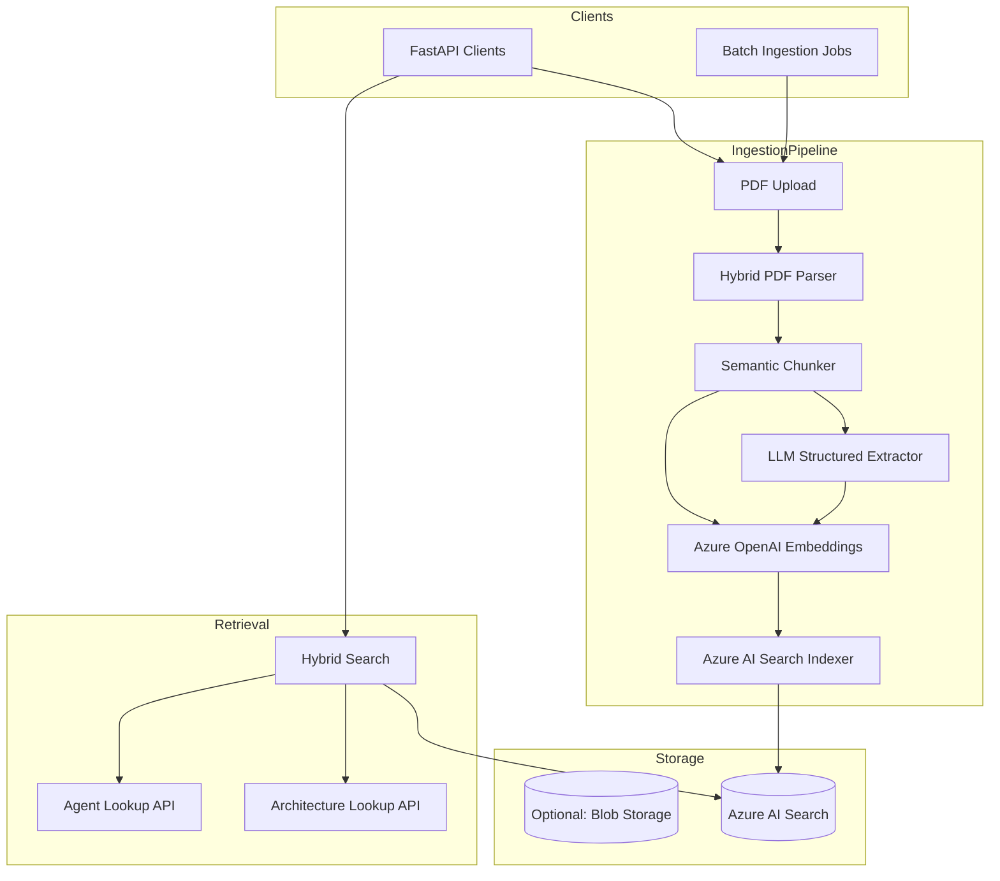

# Launchpad — Enterprise AI Architecture Memory Platform

## 1. Executive Summary

Launchpad is an **AI architecture memory system**, not document storage or a generic chatbot. It solves three connected problems:

| Problem | Deliverable | Pipeline |
|---------|-------------|----------|
| **1 — Queryable PDF** | Each agent in `solution_agents.pdf` is a structured, searchable record | Parse → chunk → extract/index → Azure AI Search |
| **2 — Smart interview** | Slot-filling spec from a problem statement (adaptive questions only) | LLM slot extract → targeted Q&A → `ArchitectureSpec` |
| **3 — Architecture on canvas** | Match catalog → reuse/adapt/build → graph (nodes + edges) → render | Capability decompose → hybrid search → planner → UI + Cursor canvas |

**End-to-end:** `PDF catalog` → `interview` → `architecture plan` → `graph on canvas`.

Persistence: interview sessions and plans are stored under `data/sessions/` (survives server restart).

Future (not in scope today): OCR for scanned PDFs, Neo4j graph DB, live agent deployment, evaluation harness.

---

## 2. System Context



---

## 3. Data Flow (Ingestion)

| Stage | Input | Output | Notes |
|-------|--------|--------|-------|
| **1. Parse** | PDF bytes | `ParsedDocument` with pages, blocks, tables | PyMuPDF primary; pdfplumber for tables |
| **2. Structure** | Parsed blocks | Section tree with types | Heading heuristics + keyword classifiers |
| **3. Chunk** | Section tree | `SemanticChunk[]` with hierarchy | Project/agent/arch/workflow-aware boundaries |
| **4. Extract (per chunk)** | Chunk text | `ChunkExtraction` partial JSON | GPT-5.4 structured output, Pydantic validation |
| **5. Merge** | Partial extractions | `ProjectKnowledge` | Deduplication, normalization, confidence |
| **6. Embed** | Canonical text per entity | Vectors | Separate embed targets per entity type |
| **7. Index** | Search documents | Azure AI Search docs | Upsert by deterministic IDs (incremental) |

**Incremental indexing**: Each entity ID is deterministic (`{project_id}:{entity_type}:{slug}`). Re-ingesting the same PDF updates documents via merge/upsert without duplicates.

---

## 4. Domain Model (Enhanced Schema)

Beyond the user-provided schema, Phase 1 adds:

- **`project_id`**: stable UUID derived from source filename + content hash
- **`source_document`**: PDF filename, page ranges, ingestion timestamp
- **`relationships`**: explicit edges (agent → workflow, agent → tools)
- **`extraction_metadata`**: model version, confidence, source_chunk_ids
- **`orchestration`**: separate from flat `architecture` for multi-agent patterns
- **`integrations`**: first-class list (not only nested in agents)

```json
{
  "project_id": "uuid",
  "project_name": "",
  "industry": "",
  "business_problem": "",
  "summary": "",
  "agents": [{ "agent_id": "", "agent_name": "", ... }],
  "workflows": [{ "workflow_id": "", "name": "", "steps": [], "triggers": [] }],
  "architecture": { "pattern": "", "deployment": "", ... },
  "orchestration": {
    "framework": "",
    "pattern": "sequential|parallel|supervisor|hierarchical",
    "agent_graph_description": ""
  },
  "tech_stack": [],
  "models_used": [],
  "vector_databases": [],
  "apis_used": [],
  "integrations": [],
  "relationships": [
    { "source_type": "agent", "source_id": "", "target_type": "tool", "target_id": "", "relation": "uses" }
  ],
  "extraction_metadata": {
    "confidence_score": 0.0,
    "source_chunk_ids": [],
    "model_version": "",
    "extracted_at": ""
  }
}
```

---

## 5. Azure AI Search Schema

**Single unified index** `ai-architecture-knowledge` with `entity_type` discriminator. Rationale: hybrid queries across agents + architectures in one call; simpler ops; filter by type when needed.

| Field | Type | Searchable | Filterable | Facetable | Vector |
|-------|------|------------|------------|-----------|--------|
| `id` | Edm.String | key | | | |
| `entity_type` | Edm.String | | yes | yes | |
| `project_id` | Edm.String | | yes | | |
| `project_name` | Edm.String | yes | yes | yes | |
| `industry` | Edm.String | | yes | yes | |
| `title` | Edm.String | yes | | | |
| `content` | Edm.String | yes | | | |
| `content_vector` | Collection(Edm.Single) | | | | HNSW |
| `agent_name` | Edm.String | yes | yes | | |
| `agent_purpose` | Edm.String | yes | | | |
| `architecture_pattern` | Edm.String | | yes | yes | |
| `orchestration_framework` | Edm.String | | yes | yes | |
| `cloud_provider` | Edm.String | | yes | yes | |
| `deployment_model` | Edm.String | | yes | | |
| `tech_stack` | Collection(Edm.String) | | yes | yes | |
| `models_used` | Collection(Edm.String) | | yes | yes | |
| `tools_used` | Collection(Edm.String) | | yes | yes | |
| `capabilities` | Collection(Edm.String) | | yes | yes | |
| `workflow_keywords` | Collection(Edm.String) | | yes | | |
| `retrieval_used` | Edm.Boolean | | yes | | |
| `source_filename` | Edm.String | | yes | | |
| `source_page_start` | Edm.Int32 | | yes | | |
| `source_page_end` | Edm.Int32 | | | | |
| `confidence_score` | Edm.Double | | yes | | |
| `ingested_at` | Edm.DateTimeOffset | | yes | | |
| `structured_payload` | Edm.String | | | | JSON blob for full entity |

**Vector profile**: HNSW, cosine, 3072 dimensions (text-embedding-3-large) — configurable via env.

**Semantic configuration**: `content` as title field content; `title` as title field for semantic reranking.

---

## 6. Chunking Strategy

### Principles
1. **Never** fixed-token-only chunking for primary knowledge.
2. Preserve **section semantics** and **hierarchy**.
3. Attach **relationship context** in chunk metadata (parent section, inferred type).

### Algorithm
1. **Block assembly**: Merge parsed lines into paragraphs; detect headings (font size, bold, numbering patterns).
2. **Section classification**: Rule-based + keyword scoring → types: `project_overview`, `agent`, `architecture`, `workflow`, `tech_stack`, `deployment`, `use_case`, `constraints`, `general`.
3. **Boundary respect**: Do not split mid-table; tables become atomic chunks with `chunk_type=table`.
4. **Size guardrails**: If section > `max_chunk_chars`, split on paragraph boundaries with overlap; inherit parent metadata.
5. **Hierarchy**: `document_id → section_id → chunk_id`; chunks store `parent_section_title`, `section_type`, `page_range`.

### Chunk record
```python
SemanticChunk(
  chunk_id, document_id, section_type, section_title,
  content, page_start, page_end,
  parent_section_id, hierarchy_level,
  metadata: { project_hints, keywords }
)
```

---

## 7. Structured Extraction Strategy

### Two-pass extraction (hallucination minimization)

**Pass A — Chunk-level (grounded)**
- Input: single chunk + section type hint
- Output: `ChunkExtraction` (partial fields only if evidenced in text)
- Prompt: "Extract ONLY information explicitly stated. Use null/empty for unknown."
- Structured outputs via OpenAI JSON schema / Pydantic
- Retry: 3 attempts with exponential backoff

**Pass B — Document-level merge**
- Input: all chunk extractions + chunk summaries
- Output: `ProjectKnowledge` full schema
- Operations: dedupe agents by name similarity, merge lists, resolve conflicts (prefer higher-confidence chunk)
- Assign `confidence_score` per field group from LLM self-assessment + chunk coverage ratio

### Validation
- Pydantic v2 strict models
- Post-process normalization (trim, lowercase enums, dedupe lists)
- Reject and retry on validation failure with error feedback to LLM

### Schema evolution
- `schema_version` field on stored payloads
- Index `structured_payload` as opaque JSON — index fields denormalized for search

---

## 8. Embedding Strategy

| Entity | Embedded text template |
|--------|------------------------|
| **project** | `{name}. {industry}. Problem: {business_problem}. {summary}. Outcomes: {outcomes}` |
| **agent** | `Agent: {name}. Purpose: {purpose}. Inputs: {inputs}. Tools: {tools}. Logic: {decision_logic}. Integrations: {integrations}` |
| **workflow** | `Workflow: {name}. {description}. Steps: {steps}. Orchestration: {framework}` |
| **architecture** | `Pattern: {pattern}. Deployment: {deployment}. Cloud: {cloud}. Security: {security}. Scalability: {scalability}` |
| **chunk** (fallback) | `{section_type}: {section_title}. {content[:2000]}` |

Each entity → one search document with `content_vector`. Raw chunks indexed for recall when structured extraction misses edge content.

---

## 9. Retrieval Strategy

### Search modes
1. **Semantic (vector)**: k-NN on `content_vector`
2. **Keyword (BM25)**: full-text on `content`, `title`, `agent_name`
3. **Hybrid**: Reciprocal Rank Fusion (RRF) of vector + keyword results
4. **Semantic reranking**: Azure semantic ranker when enabled on index

### API design
| Endpoint | Purpose |
|----------|---------|
| `POST /api/v1/ingest/pdf` | Upload PDF, run full pipeline |
| `POST /api/v1/search` | General hybrid search |
| `POST /api/v1/search/agents` | Filter `entity_type=agent`, boost agent fields |
| `POST /api/v1/search/architectures` | Filter `entity_type=architecture` |
| `GET /api/v1/health` | Health check |

### Query examples mapping
| Query | Filters + strategy |
|-------|-------------------|
| "recommendation agents in retail" | `entity_type=agent`, optional `industry=retail`, hybrid |
| "multi-agent orchestration" | `entity_type=architecture`, `architecture_pattern` / content |
| "GPT-4 with RAG" | `models_used` contains, `retrieval_used=true` |
| "voice-enabled support" | semantic on content + capabilities |
| "human escalation agents" | semantic + `capabilities` |
| "Azure-deployed" | `cloud_provider=Azure` |

---

## 10. Folder Structure

```
app/
  api/           # FastAPI routers, dependencies
  core/          # config, logging, exceptions, retry
  schemas/       # Pydantic API + domain models
  parsers/       # PDF parsing
  chunkers/      # Semantic chunking
  extractors/    # LLM extraction
  embeddings/    # Azure OpenAI embeddings
  search/        # Index management, query building
  services/      # Orchestration (ingestion, search)
  prompts/       # Versioned prompt templates
  utils/         # IDs, text normalization
```

---

## 11. Non-Functional Requirements

| Concern | Approach |
|---------|----------|
| **Async** | FastAPI async routes; `asyncio.to_thread` for CPU-bound PDF parse |
| **Large PDFs** | Streaming page parse; configurable page batch size |
| **Retries** | Tenacity on LLM, embeddings, search upsert |
| **Observability** | Structured logging (structlog), correlation IDs per ingestion |
| **Secrets** | pydantic-settings from env; no secrets in code |
| **Errors** | Domain exceptions → HTTP problem details |

---

## 12. Edge Cases

- Scanned PDFs (no text layer): detect low text density → return clear error (OCR deferred to Phase 2)
- Multi-project PDFs: merge pass may yield multiple projects → index each separately
- Duplicate agent names: merge by normalized name within project
- Partial extraction failure: index chunks + whatever structured data succeeded; flag `confidence_score`
- Index missing: auto-create on startup (configurable)

---

## 13. Phase 2 Hooks (built into Phase 1)

- `project_id` / `relationships` ready for graph DB
- `structured_payload` preserves full JSON for future agents
- `schema_version` on extractions
- Correlation ID in logs for pipeline tracing
- Pluggable `EmbeddingProvider` / `SearchClient` interfaces

---

## 14. Technology Choices

| Component | Choice | Rationale |
|-----------|--------|-----------|
| API | FastAPI | Async, OpenAPI, production ecosystem |
| PDF | PyMuPDF + pdfplumber | Speed + table fidelity |
| LLM | Azure OpenAI GPT-5.4 | Structured extraction quality |
| Vectors | Azure OpenAI embeddings | Consistent with Azure stack |
| Search | Azure AI Search | Hybrid + vector + semantic ranker |
| Validation | Pydantic v2 | Strict schemas, JSON schema export |
| LangChain | Not used | Direct SDK simpler for this pipeline |
